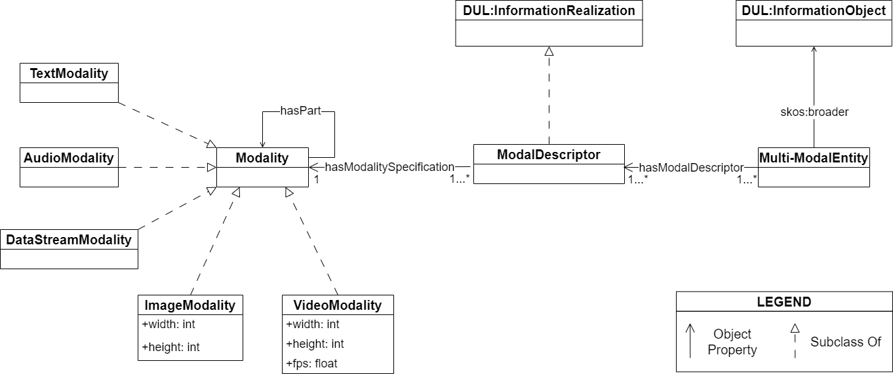

# A Pattern to Align them All: Integrating Different Modalities to Define Multi-Modal Entities
This repository contains the conceptual model and the application and alignment files for the multi-modal ontology design pattern described in the paper *"A Pattern to Align them All: Integrating Different Modalities to Define Multi-Modal Entities"*

## Multi-Modal ODP conceptual model

We propose a novel ontology design pattern (ODP) that captures the separation of concerns
between an entity (and the information it conveys), whose semantics can have
different manifestations across different media, and its realisation in terms of a
physical information entity.
The ODP's goal is to represent information entities with their associated modalities, of diverse nature, and the corresponding relationships between them
(**AIM1**) while providing flexibility and extensibility to seamlessly incorporate new
modalities and adapt to changes in existing ones (**AIM2**). These  two aims[^1] determine
the requirements underlying the pattern’s design: **AIM1** identifies the functional requirements that the pattern should satisfy and that we represent in the four competency
questions (CQs):

- CQ1: What are the modalities that interact in the definition of a data resource?
- CQ2: If applicable, which other modalities do a modality subsume?
- CQ3: What is(are) the relation(s) between a resource and the modalities associated with it?
- CQ4: What is the format associated with a resource?

**AIM2** relates to the set of (non-functional) requirements:

1. The pattern should support the integration of different modalities that model holistically the same entity.
2. The pattern should promote semantic agreement on the definition of modality.
3. The pattern should represent modalities at the highest level of abstraction, therefore
ensuring a separation of concerns between the specific downstream applications.
supported and the content of the pattern.
4. The pattern should be domain agnostic, task-independent and easy to use.
5. The pattern should promote modular development and be extensible, therefore allowing users to define new modalities and express relationships between them.

## Multi-Modal ODP Applications
- FuS-KG: A Multi-Modal Knowledge Graph Supporting
Personalized Health [[WEBSITE]](https://horus-ai.fbk.eu/fuskg/) [[REPO]](https://github.com/IDA-FBK/FuS-KG) [[DIAGRAMS]](/diagrams/applications_and_alignments/applications/FuS-KG/)
 

## Multi-Modal ODP Alignments
- The Multimodal Description of Social Concepts Ontology (MUSCO): [[REPO]](https://github.com/delfimpandiani/musco) [[DIAGRAMS]](/diagrams/applications_and_alignments/alignments/MUSCO/) [[ALIGNED ONTOLOGY]](/ontology/alignments/musco_alignment.ttl)
- The Ontology for Multimodal Knowledge Graphs for Data Spaces: [[DIAGRAMS]](/diagrams/applications_and_alignments/alignments/MMKG-Dataspaces/) [[ALIGNED ONTOLOGY]](ontology/alignments/dataspaces_alignment.ttl)
- The Polifonia Ontology Network (PON) - CoMeta: [[REPO]](https://github.com/polifonia-project/cometa-ontology/) [[DIAGRAMS]](/diagrams/applications_and_alignments/alignments/Cometa/) [[ALIGNED ONTOLOGY]](https://github.com/IDA-FBK/MultiModalPattern/blob/general-update-00/ontology/alignments/cometa_alignment.ttl)
  
[^1]: for further details, refer to Sections 3 and 4 of the paper.

## Authors
- Gianluca Apriceno: apriceno@fbk.eu
- Valentina Tamma: V.Tamma@liverpool.ac.uk
- Tania Bailoni: tbailoni@fbk.eu
- Jacopo de Berardinis: jacodb@liverpool.ac.uk 
- Mauro Dragoni: dragoni@fbk.eu
